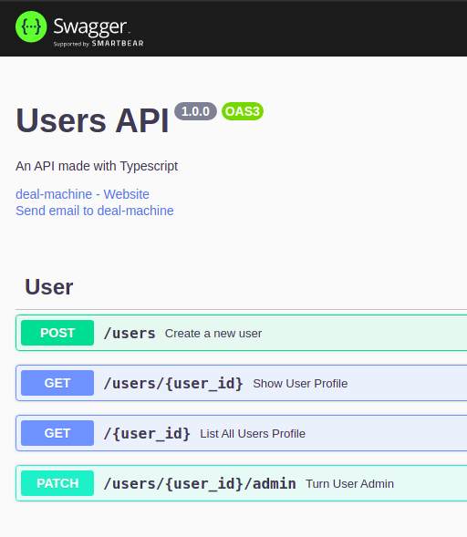
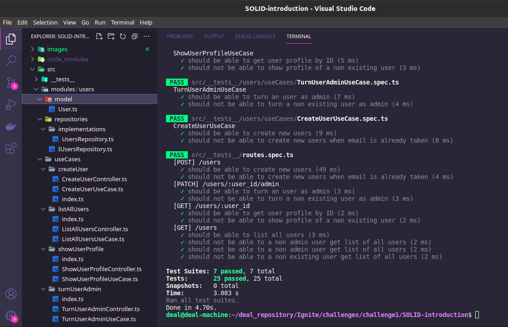

# 
SOLID Principles

Starting API with superset Typescript :heavy_check_mark:
 
Introduction to SOLID Principles :heavy_check_mark:
 
API Documentation with Swagger :heavy_check_mark:
 
Tests with Jest :heavy_check_mark:
 
<h3>To run :electric_plug: </h3>
<h5>Open terminal in folder where you have cloned the project.</h5>
Run <strong>yarn</strong> or <strong>npm install</strong>
 
:heavy_plus_sign: To build the dependencies
  
Run <strong>yarn dev</strong> or <strong>npm run dev</strong> 
 
:heavy_plus_sign: To run the application
  
Run <strong>yarn test</strong> or <strong>npm run test</strong>
 
:heavy_plus_sign: To run the tests
  

  

